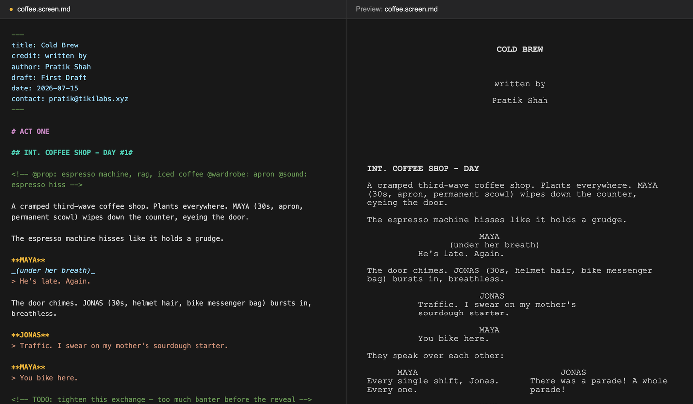
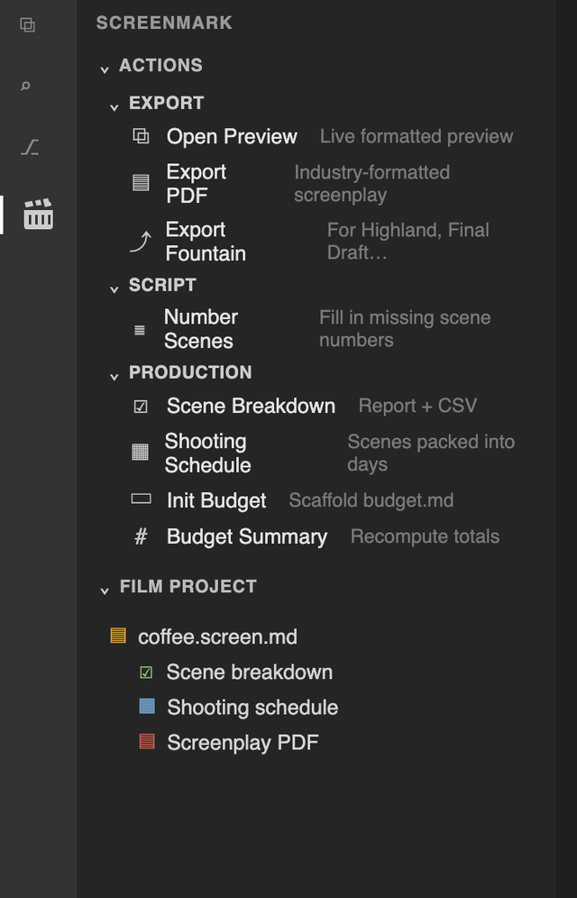
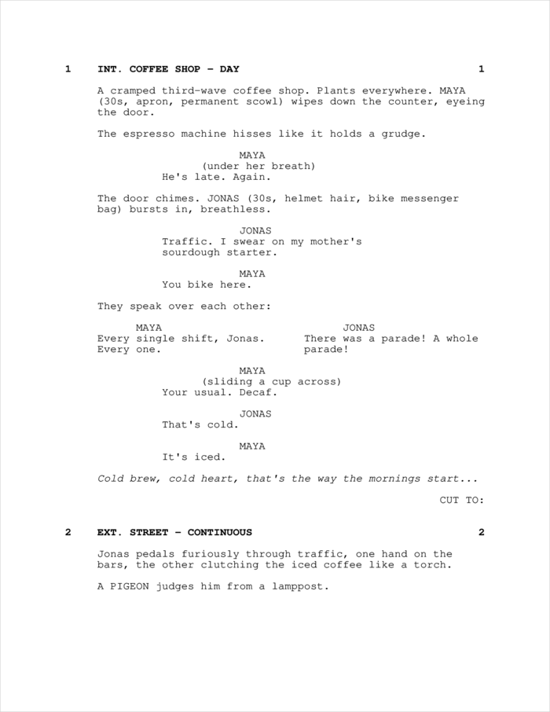
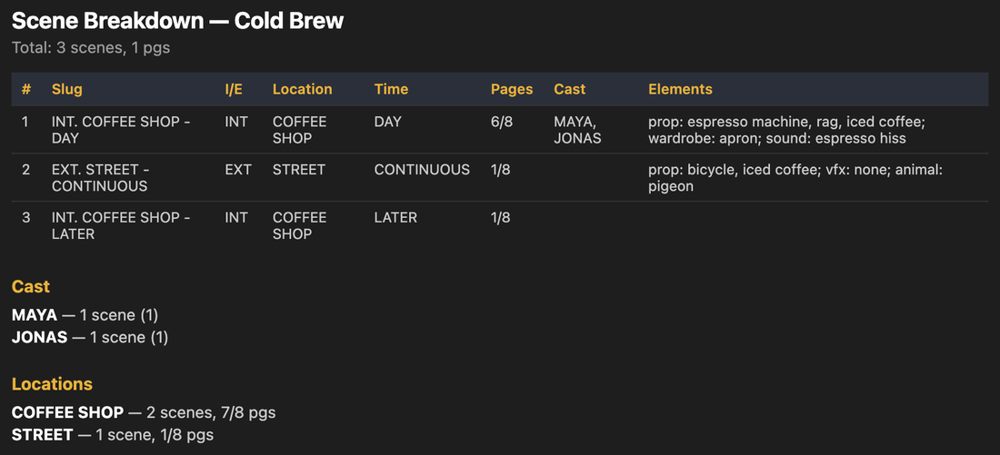
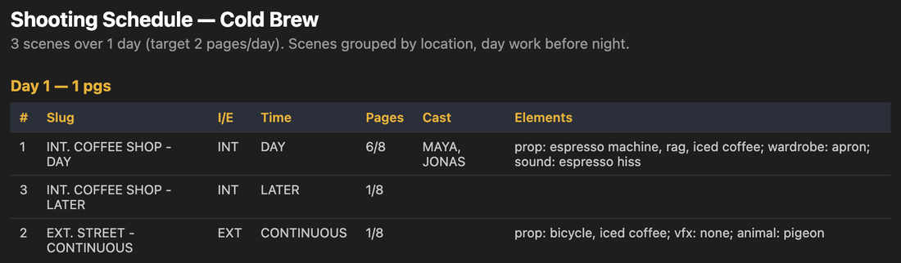

<div align="center">


# ScreenMark

**Write screenplays in markdown. Export real screenplay PDFs — then plan the shoot.**

For Cursor and VS Code.

</div>



## Why

Screenwriting apps lock your script in their format. ScreenMark keeps it in plain markdown you already know, in the editor you already use, under version control — and still gives you a correctly formatted PDF.

Then it goes further: your script is structured data, so ScreenMark reads it back to build scene breakdowns, shooting schedules, and budgets.

## Write

````markdown
---
title: Cold Brew
credit: written by
author: Your Name
---

## INT. COFFEE SHOP - DAY #1#

Maya wipes down the counter, eyeing the door.

**MAYA**
_(under her breath)_
> He's late. Again.

@CUT TO:
````

Files are `.smark` or `*.screen.md` — the `.md` flavor still renders fine on GitHub.

| Element | Syntax |
|---|---|
| Title page | frontmatter: `title`, `credit`, `author`, `draft`, `date`, `contact` |
| Act / section | `# ACT ONE` — outline only, never printed |
| Scene heading | `## INT. COFFEE SHOP - DAY` |
| Scene number | trailing `#4A#` — prints in both margins |
| Action | plain paragraphs |
| Character | `**MAYA**` on its own line (`**MAYA (V.O.)**` works) |
| Parenthetical | `_(under her breath)_` |
| Dialog | `> ` lines under a character |
| Dual dialog | `**JONAS** ^` — prints side by side |
| Lyric | `~ sung line` |
| Transition | `@CUT TO:` |
| Centered | `> THE END <` |
| Page break | `---` |
| Note | `<!-- fix pacing -->` — never printed |

An actual blank line ends a dialog block. Comment-only lines, including blank lines inside multiline notes, do not interrupt dialogue or action paragraphs. Leading notes may precede title frontmatter; a real leading blank still prevents frontmatter recognition.

PDF export uses Courier’s Western European glyph coverage. Unsupported rendered characters, oversized title fields and documents without printable content produce errors before writing a file; title-only documents are valid. Fountain export forces parsed action and character types, and rejects text it cannot represent faithfully.

**Editor help:** syntax highlighting, character/scene/transition autocomplete, nested scene outline, folding, inline comment highlighting, and snippets (`title`, `scene`, `dialog`, `dual`, `trans`).

## The ScreenMark sidebar

Click the clapperboard in the Activity Bar for one-click access to everything — no command palette needed.



**Actions** groups every command by task; **Film Project** lists your scripts with their generated docs. The two most-used actions — Open Preview and Export PDF — also sit in the editor's title bar toolbar.

## Export

| Command | Result |
|---|---|
| **Export PDF** | US Letter, Courier 12pt, industry margins, title page, `(MORE)`/`(CONT'D)`, dual-dialog columns |
| **Export Fountain** | standard `.fountain` for Highland, Slugline, Final Draft |
| **Open Preview** | live formatted preview that follows your scroll |
| **Number Scenes** | fills in missing `#n#`, never renumbers existing ones |



## Plan the shoot

Tag production elements inside any note:

```markdown
<!-- @prop: revolver, whiskey glass @wardrobe: red coat @vfx: muzzle flash -->
```

**Scene Breakdown** turns the script into a report (`.md` + `.csv`) — location, time, speaking cast, tagged elements, and conservative scene estimates in eighths. Speaking cast comes only from dialogue cues; silent performers are not inferred. The complete screenplay is paginated once, retained body rows are assigned to scenes, and each estimate is rounded up as `max(1, ceil(rows × 8 / 54))`. Title pages, pre-scene material and unused page tails do not count. The sum can exceed the physical PDF page count, especially with many short scenes.



**Shooting Schedule** packs those scene estimates into days, grouped by location and then exact day/night labels, sized by `screenmark.pagesPerDay` (default 5). This is a draft scheduling heuristic; review the practical shooting order.



**Init Budget** scaffolds `budget.md` in the active document’s workspace root; **Budget Summary** recomputes owned generated tables and over/under variance in place. User notes and unowned Totals sections are preserved. Amounts use exact cents: blank cells are allowed, while invalid nonempty amounts, sub-cent values and unsafe totals stop the refresh without editing. The **Film Project** panel in the ScreenMark sidebar keeps every script, report, and budget one click away.

Scene numbers are the glue — number once, and every report keeps pointing at the same scene as the script moves around.

## Install

Grab the `.vsix` from [Releases](https://github.com/tekierz/screen-mark/releases) and:

```bash
cursor --install-extension screen-mark-0.3.2.vsix   # or: code --install-extension ...
```

## Develop

```bash
bun install --frozen-lockfile
bun run verify    # typecheck, regression tests, bundled build
bun run smoke     # real isolated VS Code host
bun run package   # verify, regenerate samples, package, installed-artifact smoke
```

Use Bun 1.3.11 (pinned in package metadata). The local release command produces `screen-mark-0.3.2.vsix` and fails if a check fails. It uses the exact-pinned packager with dependency discovery disabled; PDFKit, font metrics and third-party notices are bundled. Set `SCREENMARK_CODE` to your VS Code CLI path and `SCREENMARK_EDITOR` to the editor executable if they are not installed at the default macOS locations. The release PDF check requires Poppler (`pdftotext` and `pdftoppm`). Smoke tests use temporary profiles and a two-root workspace.

Press <kbd>F5</kbd> to launch a dev host with the sample script open.

Everything that parses and renders lives in `src/core/` with no `vscode` imports, so it can move to a CLI or web tool unchanged. `src/features/` holds the editor integration.

## Roadmap

Call sheets, cast day-out-of-days, and budget estimates seeded from the breakdown.

## License

MIT
